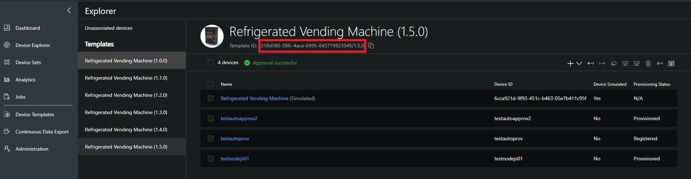
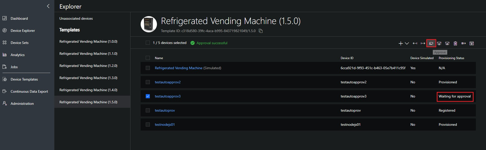
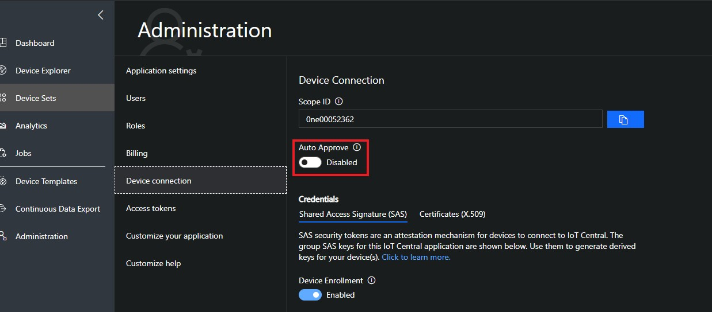

# Microsoft Azure IoTCentral SDK for Python

[](https://gitter.im/iotdisc/community?utm_source=badge&utm_medium=badge&utm_campaign=pr-badge&utm_content=badge)
[](https://github.com/lucadruda/iotc-python-device-client/blob/master/LICENSE)


## Prerequisites
+ Python 2.7+ or Python 3.7+ (recommended)

## Installing `azure-iotcentral-device-client`

```
pip install azure-iotcentral-device-client
```
These clients are available with an asynchronous API, as well as a blocking synchronous API for compatibility scenarios. **We recommend you use Python 3.7+ and the asynchronous API.**

| Python Version | Asynchronous API | Synchronous API |
| -------------- | ---------------- | --------------- |
| Python 3.5.3+  | **YES**          | **YES**         |
| Python 2.7     | NO               | **YES**         |


## Samples
Check out the [sample repository](samples) for example code showing how the SDK can be used in the various scenarios:

*   Sending telemetry and receiving properties and commands with device connected through symmetric key (Python 2.7+)

*   Sending telemetry and receiving properties and commands with device connected through symmetric key (Python 3.7+)
*   Sending telemetry and receiving properties and commands with device connected through x509 certificates (Python 2.7+)
*   Sending telemetry and receiving properties and commands with device connected through x509 certificates (Python 3.7+)

Samples by default parse a configuration file including required credentials. Just create a file called **samples.ini** inside the _samples_ folder with this content:

```ini
[SymmetricKey]
ScopeId = scopeid
DeviceId = deviceid
Key = group_or_device_key

[x509]
ScopeId = scopeid
DeviceId = deviceid
CertFilePath = path_to_cert_file
KeyFilePath = path_to_key_file
CertPassphrase = optional password
```
The configuration file can include one of the sections or both. Section names must match references in the sample file.

## Importing the module
Sync client (Python 2.7+ and 3.7+) can be imported in this way:

```py
from azure.iotcentral.device.client import IoTCClient
```
Async client (with asyncio for Python 3.7+ only) can be imported like this:

```py
from azure.iotcentral.device.client.aio import IoTCClient
```

## Connecting

#### X509
```py
scopeId = 'scopeID';
device_id = 'device_id';
key = {'certFile':'<CERT_CHAIN_FILE_PATH>','keyFile':'<CERT_KEY_FILE_PATH>','certPhrase':'<CERT_PASSWORD>'}

iotc = IoTCClient(device_id, scopeId,
                  IOTCConnectType.IOTC_CONNECT_X509_CERT, key)
```
IOTCConnectType enum can be imported from the same module of IoTCClient

_'certPhrase'_ is optional and represents the password for the certificate if any

**_A handy tool to generate self-signed certificates in order to test x509 authentication can be found in the IoTCentral Node.JS SDK [here.](https://github.com/lucadruda/iotc-nodejs-device-client#generate-x509-certificates)_**


#### SAS
```py
scopeId = 'scopeID';
device_id = 'device_id';
sasKey = 'masterKey'; # or use device key directly

iotc = IoTCClient(device_id, scopeId,
                  IOTCConnectType.IOTC_CONNECT_SYMM_KEY, sasKey)
```
IOTCConnectType enum can be imported from the same module of IoTCClient

### Connect
Sync
```
iotc.connect()
```
Async
```py
await iotc.connect()
```
After successfull connection, IOTC context is available for further commands.


### Send telemetry

e.g. Send telemetry every 3 seconds
```py
while iotc.isConnected():
        await iotc.send_telemetry({
            'accelerometerX': str(randint(20, 45)),
            'accelerometerY': str(randint(20, 45)),
            "accelerometerZ": str(randint(20, 45))
        })
        time.sleep(3)
```
An optional *properties* object can be included in the send methods, to specify additional properties for the message (e.g. timestamp, content-type etc... ).
Properties can be custom or part of the reserved ones (see list [here](https://github.com/Azure/azure-iot-sdk-csharp/blob/master/iothub/device/src/MessageSystemPropertyNames.cs#L36)).

### Send property update
```py
iotc.sendProperty({'fieldName':'fieldValue'});
```
### Listen to properties update
```py
iotc.on(IOTCEvents.IOTC_PROPERTIES, callback);
```
To provide setting sync aknowledgement, the callback must reply **True** if the new value has been applied or **False** otherwise
```py
async def onProps(propName, propValue):
    print(propValue)
    return True

iotc.on(IOTCEvents.IOTC_PROPERTIES, onProps);
```

### Listen to commands
```py
iotc.on(IOTCEvents.IOTC_COMMAND, callback)
```
To provide feedbacks for the command like execution result or progress, the client can call the **ack** function available in the callback.

The function accepts 3 arguments: command name, a custom response message and the request id for which the ack applies.
```py
async def onCommands(command, ack):
    print(command.name)
    await ack(command.name, 'Command received', command.request_id)
```

## One-touch device provisioning and approval
A device can send custom data during provision process: if a device is aware of its IoT Central template Id, then it can be automatically provisioned.

### How to set IoTC template ID in your device
Template Id can be found in the device explorer page of IoTCentral


Then call this method before connect():

```py
iotc.setModelId('<modelId>');
```

### Manual approval (default)
By default device auto-approval in IoT Central is disabled, which means that administrator needs to approve the device registration to complete the provisioning process.
This can be done from explorer page after selecting the device



### Automatic approval
To change default behavior, administrator can enable device auto-approval from Device Connection page under the Administration section.
With automatic approval a device can be provisioned without any manual action and can start sending/receiving data after status changes to "Provisioned"


